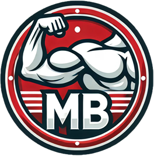

# Muscles & Balance

Welcome to **Muscles & Balance** – your all-in-one platform for achieving a healthier, more balanced lifestyle! Whether you want to optimize your nutrition, find the perfect workout, track supplements, or simply learn more about fitness, this project is designed to empower you at every step of your journey.

---

## 🎬 Project Presentation Video

Curious to see Muscles & Balance in action? Click the image above or [watch the full presentation on YouTube](https://youtu.be/bhsddRrvvh0?si=TISFgPWqLhPs5UgX) for a guided tour and feature highlights!

---

## 🌟 Project Overview

Muscles & Balance is a modern, interactive web application that provides:
- **Personalized workout plans**
- **Calorie and nutrition calculators**
- **Supplement recommendations and tracking**
- **Meal planners and diet guides**
- **1-minute workout challenges**
- **Educational articles and videos**
- **A beautiful, responsive user interface**

All features are 100% free and accessible to everyone!

---

## 🚀 Main Features

- **Home Page (`home.htm`)**: Central hub with navigation to all features, platform introduction, and a slideshow of highlights.
- **Personalized Workouts (`workout.htm`)**: Generate custom workout plans based on your fitness level, goals, and preferences. Includes a 1-minute challenge and a comprehensive exercise list with video demonstrations.
- **Nutrition Tools (`nutrition.htm`)**: Calculate your daily calorie and macronutrient needs, plan meals, and explore diet options (e.g., vegan, carnivore, weight loss/gain).
- **Supplement Center (`supplements.htm`)**: Take a supplement quiz for recommendations, track your supplements, and learn about different types.
- **Help & Guides (`help.htm`)**: Step-by-step video guides, platform navigation tips, and feature explanations.
- **Authentication (`login.htm`, `register.js`)**: Secure sign-in/sign-up with Firebase, including Google authentication and email verification.
- **Contact & Legal**: Contact form, privacy policy, and terms of service.

---

## 📁 Project Structure & File Explanations

### HTML Pages
- **`index.htm`**: Welcome/landing page with intro, navigation, and feature highlights.
- **`home.htm`**: Main dashboard with links to all sections and a feature overview.
- **`workout.htm`**: Workout plan generator, exercise articles, and 1-minute challenge.
- **`nutrition.htm`**: Calorie/macro calculator, meal planner, and diet guides.
- **`supplements.htm`**: Supplement quiz, tracker, and educational content.
- **`help.htm`**: Interactive help and video guides for all features.
- **`login.htm`**: User authentication (sign in/up/forgot password).
- **`contact.htm`**: Contact form for user feedback and support.
- **`privacy.htm`, `terms.htm`**: Privacy policy and terms of service.
- **`gainW.htm`, `loseW.htm`, `vegan.htm`, `carnivore.htm`**: Specialized diet and nutrition articles.

### JavaScript Modules (`public/js/`)
- **`main.js`**: Handles navigation, sticky headers, and UI animations.
- **`welcome.js`**: Animates the welcome page and feature reveals.
- **`script.js`**: Core logic for workout plan generation, including personalized weekly splits and video demos.
- **`challenge.js`**: Implements the 1-minute workout challenge with timers, exercise selection, and motivational feedback.
- **`calorie.js`**: Multi-step calorie and macronutrient calculator with PDF export.
- **`meal.js`**: Meal planner logic, dynamic food item management, and nutritional analysis.
- **`supplements.js`**: Supplement quiz logic and personalized recommendations.
- **`scan.js`**: Barcode scanner for nutrition info (integrates with external API).
- **`login.js`**: UI logic for authentication forms.
- **`register.js`**: Handles Firebase authentication, Google sign-in, and user state management.

### CSS Styles (`public/css/`)
- **`style.css`**: Main theme and layout for workout/nutrition pages.
- **`home.css`**: Styles for the home/dashboard page.
- **`welcome.css`**: Landing page and intro animations.
- **`supplements.css`**: Supplement center and quiz styles.
- **`help.css`**: Help and guide page styling.
- **`challenge.css`**: 1-minute challenge and timer visuals.
- **`login.css`**: Authentication and form styles.
- **`contact.css`**: Contact form and support page styles.

### Media & Assets
- **`images/`**: Logos, exercise illustrations, diet images, and more.
- **`videos/`**: Backgrounds, workout/nutrition demos, and feature intros.
- **`guide videos/`**: Step-by-step video guides for every major feature.

---

## 🧩 How the Code Works

- **Workout Plan Generator**: `script.js` dynamically builds a weekly workout plan based on user input (fitness level, goal, equipment, days/week), using a pool of exercises and embedded YouTube videos.
- **1-Minute Challenge**: `challenge.js` provides a fast-paced, randomized workout with timers, video demos, and motivational messages.
- **Nutrition & Meal Planner**: `calorie.js` and `meal.js` calculate daily needs, allow food entry, and analyze nutritional content. Results can be exported as PDF.
- **Supplement Quiz**: `supplements.js` recommends supplements based on user goals, activity, and diet type.
- **Barcode Scanner**: `scan.js` lets users scan food barcodes to fetch nutrition info from an external API.
- **Authentication**: `register.js` and `login.js` manage user accounts, Google sign-in, and session state using Firebase.
- **UI/UX**: All CSS files ensure a modern, responsive, and visually appealing experience across devices.

---

## 📚 Learn More & Get Started

- **Explore the Home Page** for quick access to all features.
- **Try the Workout Generator** to get a custom plan.
- **Calculate your calories and macros** in the Nutrition section.
- **Take the Supplement Quiz** for personalized recommendations.
- **Watch the Guide Videos** in the Help section for step-by-step instructions.

---

## 🤝 Contributing

Contributions are welcome! Feel free to fork the project, open issues, or submit pull requests to help improve Muscles & Balance.

---

## 📧 Contact

For questions, feedback, or support, use the [Contact Page](public/contact.htm) or email the project maintainers.

---

**Muscles & Balance** – Make the world healthy again!
